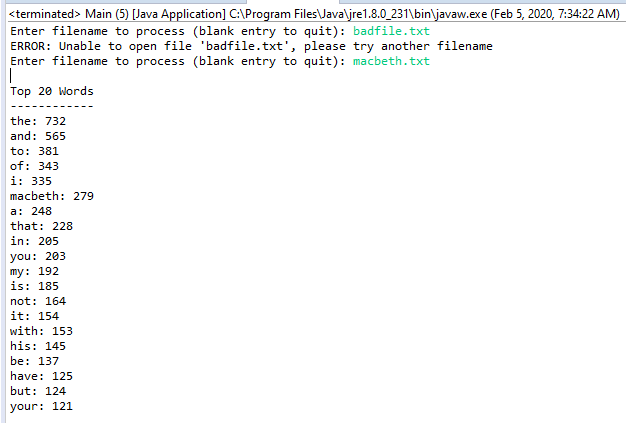

# CEN3024C-Assignment2
My source code submission for module 2

**Project criteria and specifications were as follows:**

Write a text analyzer that reads a file and outputs statistics about that file. It should output the word frequencies of all words in the file, sorted by the most frequently used word. The output should be a set of pairs, each pair containing a word and how many times it occurred in the file.

## Learning Outcomes
- Student will create a plan for developing a software solution.
- Student will create software to solve basic business problems.

## Assignment Instructions
- Submit a screen shot of the top 20 words in the following file (a play): http://shakespeare.mit.edu/macbeth/full.html
- Submit text analyzer program to GIT hub repository.
- Submit your GIT repository link.
- Submit your written plan for creating this solution.

### Screenshot

Example screenshot taken from http://shakespeare.mit.edu/macbeth/full.html. The link was opened in a web browser and all of the text was copied to a text file titled macbeth.txt.

